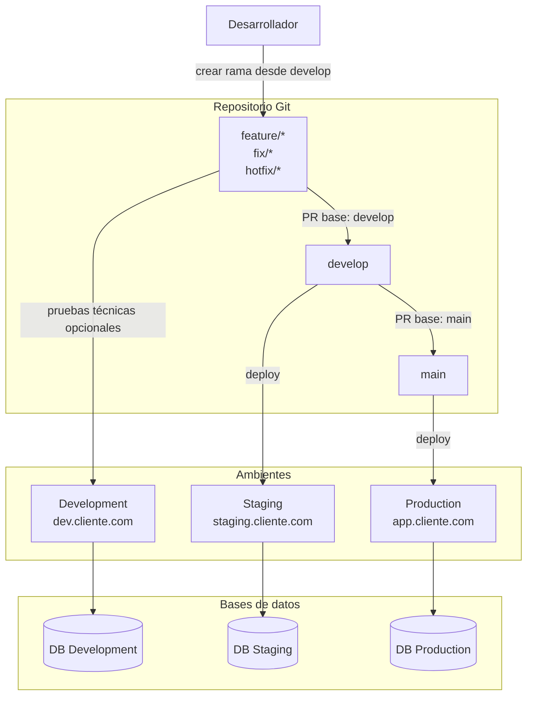

# Propuesta de Arquitectura de Ambientes

**Elaborado por:** Ing. Victor Gerardo Zuñiga Gamboa  
**Cliente:** Siccoms  
**Fecha:** 21 de abril de 2025  
**Versión:** v1.0  

---

## Objetivo

Definir una base técnica clara para separar el sistema en tres ambientes independientes: **Production**, **Staging** y **Development**. La finalidad es agilizar el trabajo, reducir riesgos al publicar cambios y establecer un flujo ordenado de desarrollo, validación y liberación.

---

## Contexto

El sistema actual está montado en un hosting con cPanel y fue desarrollado con CodeIgniter. A partir de este escenario, la propuesta considera una estrategia compatible con subdominios por ambiente, un solo repositorio Git, ramas organizadas por flujo de trabajo y configuraciones independientes por entorno.

---

## Ambientes propuestos

### Production

Ambiente estable y público. Recibe únicamente cambios previamente aprobados y validados.

- URL de referencia: `app.cliente.com`
- Conecta a su propia base de datos productiva
- No debe usarse para pruebas técnicas de ningún tipo
- Rama desplegada: `main`

### Staging

Ambiente de validación previa a producción. Replica el comportamiento esperado del sistema en producción y sirve como punto de revisión antes de liberar cambios.

- URL de referencia: `staging.cliente.com`
- Útil para QA, validación funcional y revisión con el cliente
- Base de datos independiente; puede usarse una copia controlada de producción si es necesario
- Servicios externos configurados idealmente en modo sandbox
- Rama desplegada: `develop`

### Development

Ambiente técnico para pruebas durante el desarrollo. No requiere una rama fija; puede desplegar temporalmente cualquier rama de trabajo en curso.

- URL de referencia: `dev.cliente.com`
- Usado para revisar cambios en construcción (`feature/*`, `fix/*`, `hotfix/*`)
- Base de datos independiente con datos de prueba
- Rama desplegada: variable según la prueba técnica en curso

---

## Diagrama general

---

## Estrategia de repositorio Git

Se recomienda usar **un solo repositorio** para todo el sistema. Esto permite mantener una línea de evolución unificada del código, facilita la trazabilidad de cambios, evita divergencias entre ambientes y simplifica el mantenimiento a largo plazo.

Usar un repositorio por ambiente no es recomendable, ya que suele generar desalineación entre versiones y trabajo duplicado.

---

## Estructura de ramas

### `main`

Rama estable de producción. Solo recibe cambios ya validados en Staging. Alimenta el ambiente Production.

### `develop`

Rama de integración. Concentra los cambios aprobados provenientes de las ramas de trabajo. Alimenta el ambiente Staging.

### `feature/*`

Ramas para el desarrollo de nuevas funcionalidades.

Ejemplos: `feature/nuevo-login`, `feature/reporte-clientes`

### `fix/*`

Ramas para correcciones normales durante el ciclo de desarrollo.

Ejemplos: `fix/error-formulario`, `fix/validacion-correo`

### `hotfix/*`

Ramas para correcciones urgentes que impactan producción.

Ejemplos: `hotfix/error-pago`, `hotfix/fallo-login-prod`

---

## Flujo de trabajo

### 1. Inicio

El desarrollador parte de `develop` actualizada y crea una rama de trabajo según el tipo de cambio: `feature/*`, `fix/*` o `hotfix/*`.

### 2. Desarrollo

Los cambios se trabajan en la rama correspondiente. Si se requiere validación técnica visual, la rama puede desplegarse temporalmente en el ambiente Development.

### 3. Integración

Cuando el cambio está listo, se crea un Pull Request hacia `develop`:

- Base: `develop`
- Compare: `feature/nueva-funcionalidad` (o la rama correspondiente)

### 4. Validación en Staging

Una vez integrado en `develop`, el ambiente Staging recibe el cambio automáticamente. Aquí se realizan pruebas funcionales, QA, validación interna y revisión con el cliente si aplica.

### 5. Promoción a producción

Cuando lo integrado en Staging queda validado, se crea un Pull Request de `develop` hacia `main`:

- Base: `main`
- Compare: `develop`

### 6. Liberación

Production despliega la rama `main`. El cambio queda disponible para los usuarios finales.

---

## Relación entre ramas y ambientes

Es importante distinguir que `develop` es una **rama** y Development es un **ambiente**. No son lo mismo ni tienen una relación fija obligatoria.

| Ambiente | Rama desplegada |
|---|---|
| Development | Variable (`feature/*`, `fix/*`, `hotfix/*`) |
| Staging | `develop` |
| Production | `main` |

---

## Configuración por ambiente

Cada ambiente debe tener su propia configuración para los siguientes aspectos, de modo que ningún ambiente pueda afectar a otro:

- URL base
- Credenciales de base de datos
- Configuración de correo
- APIs externas
- Pasarelas de pago
- Almacenamiento de archivos
- Logs y nivel de depuración

---

## Manejo de bases de datos

Cada ambiente opera con su propia base de datos:

| Ambiente | Base de datos |
|---|---|
| Production | DB Production |
| Staging | DB Staging (puede ser copia controlada de producción) |
| Development | DB Development (datos de prueba únicamente) |

Las bases de datos no deben compartirse entre ambientes bajo ninguna circunstancia.

---

## Control de flujo y gobernanza

### Protección de ramas (`main` y `develop`)

Se configurarán **GitHub Rulesets** para proteger las ramas críticas sin costo adicional en el plan Free:

- **Restricción de push directo:** nadie puede subir cambios directamente a `main` o `develop`; todo cambio debe pasar por un Pull Request.
- **Bloqueo de force push:** se impide la reescritura del historial en las ramas de producción y staging, garantizando trazabilidad total.
- **Bloqueo de eliminación de ramas:** evita el borrado accidental de las ramas que alimentan los ambientes.

### Protocolo de revisión manual

Dado que el plan gratuito no permite bloquear el merge por aprobación automatizada en repositorios privados, se establece el siguiente protocolo operativo:

- **Revisión por pares:** todo PR hacia `develop` o `main` debe contar con el visto bueno explícito (comentario de aprobación) de un compañero antes de que el autor realice el merge.
- **Responsabilidad de integración:** el desarrollador es responsable de verificar que su rama esté actualizada respecto a la rama base antes de completar la integración.

Esta configuración cubre el 90% de la seguridad necesaria, delegando el paso final de aprobación a la comunicación y disciplina del equipo.

### Estándar de nomenclatura

Se mantiene la convención de prefijos para facilitar la identificación y limpieza del repositorio:

| Prefijo | Uso |
|---|---|
| `feature/` | Nuevas funcionalidades |
| `fix/` | Correcciones en ciclo normal |
| `hotfix/` | Correcciones urgentes en producción |

---

## Manejo de incidencias en Staging

Si un cambio integrado en `develop` rompe el ambiente Staging, el procedimiento es:

1. Identificar el commit o PR responsable.
2. Revertir el cambio en `develop` usando `git revert`.
3. Redesplegar Staging.
4. Corregir el problema en una nueva rama de trabajo.

En ramas compartidas como `develop` y `main` siempre se debe usar `git revert`. Se debe evitar la reescritura de historial (`git reset`, `git push --force`).

---

## Implementación sugerida por fases

### Fase 1 — Separación de ambientes y control de versiones

- Creación de subdominios por ambiente
- Configuración de bases de datos independientes
- Definición del repositorio Git y estructura de ramas
- Configuración de GitHub Rulesets
- Despliegue manual controlado

### Fase 2 — Estandarización operativa

- Documentación del proceso de despliegue
- Checklist de validación antes de pasar a producción
- Política de backups por ambiente
- Criterios y procedimiento de rollback

### Fase 3 — Automatización gradual

- Integración con repositorio remoto
- Configuración de webhook o flujo de deploy automático
- Estandarización del proceso de promoción entre ambientes

---

## Conclusión

La estructura recomendada para este proyecto es:

- Un solo repositorio Git con ramas de trabajo organizadas por prefijo (`feature/*`, `fix/*`, `hotfix/*`)
- Rama `develop` como punto de integración, vinculada al ambiente Staging
- Rama `main` como fuente de verdad de producción, vinculada al ambiente Production
- Ambiente Development para pruebas técnicas, sin necesidad de una rama fija dedicada
- Protección de ramas críticas mediante GitHub Rulesets y protocolo de revisión por pares

Esta estructura ofrece orden, trazabilidad y una base sólida para crecer sin añadir complejidad innecesaria a la operación del equipo.
